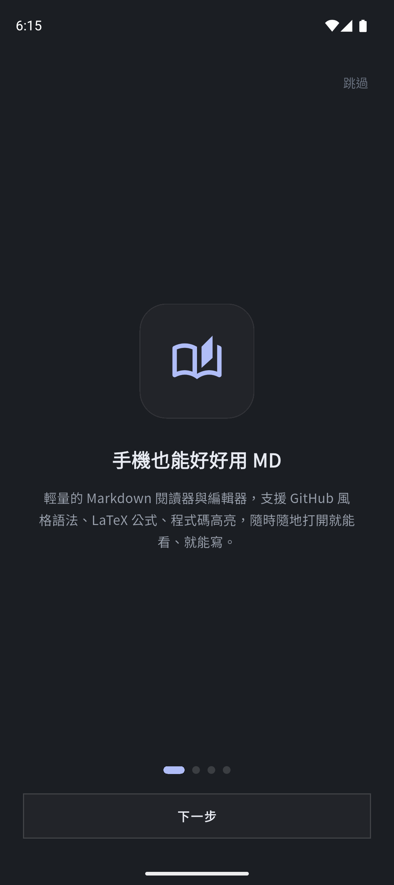
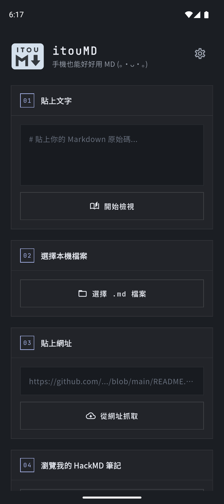
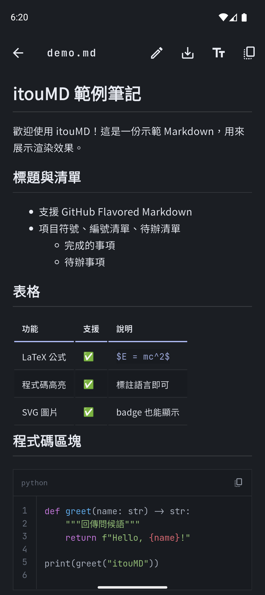
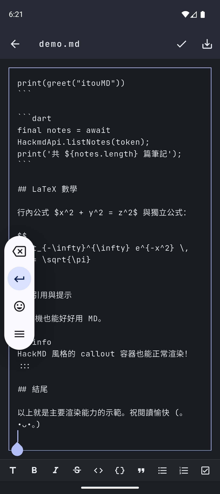
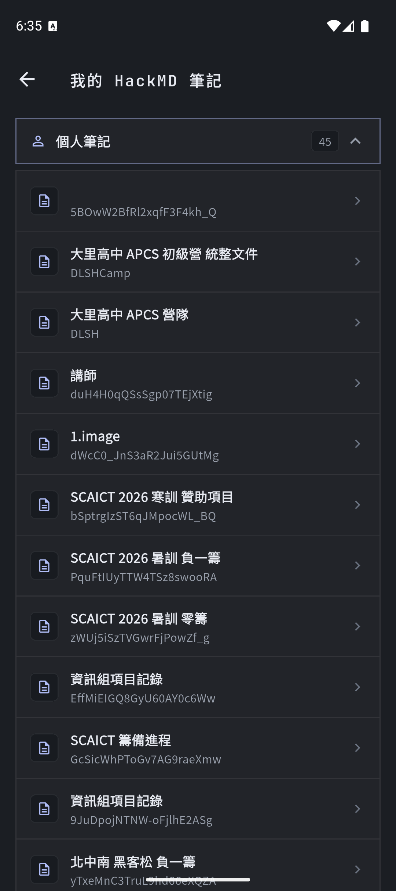
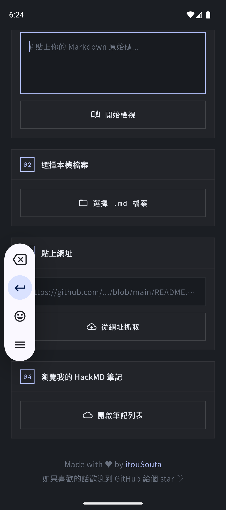

<h1>itouMD</h1>

[](https://github.com/itousouta15/itouMD/actions/workflows/ci.yml)
[](LICENSE)
[](https://github.com/itousouta15/itouMD/releases/latest)

**English：[README_EN.md](README_EN.md)**

一款用於行動裝置的現代化 Markdown 檢視器與編輯器，深度整合 HackMD。

## 截圖

| 精靈式介紹 | 首頁 | 檢視器 |
| --- | --- | --- |
|  |  |  |

| 編輯模式 | 同步雲端 | 設定 |
| --- | --- | --- |
|  |  |  |

## 功能亮點

### 閱讀與編輯

- **Markdown 渲染**：支援 GitHub Flavored Markdown (GFM)、HackMD 風格容器語法（`:::info`／`:::spoiler` 等）、`[TOC]` 目錄展開、GitHub 風格 `> [!NOTE]` alert。
- **程式碼區塊**：標了語言自動語法高亮，附**行號**與**一鍵複製**按鈕。
- **LaTeX 數學公式**：支援 inline `$...$` 與 display `$$...$$`。
- **圖片**：點開全螢幕放大，可雙指縮放（SVG badge 也能正確渲染）。
- **本機編輯器**：內建格式工具列（粗體、斜體、標題、清單、引用、連結、程式碼區塊），按 Enter 自動延續清單項目；左側**行號欄**與文字同步捲動，完成編輯後自動捲回剛才編輯的那一行。
- **多種來源**：**新建文件**（輸入標題直接開始寫，有連結 HackMD 時可一併建立雲端筆記）、貼上文字、選擇本機檔案（`.md`／`.markdown`／`.mdx`／`.txt`）、從 GitHub／Gist／HackMD 網址擷取內容。
- **閱讀偏好**：字體（8 種＋**匯入自訂字型**）、字級、文字顏色（9 種預設色＋**自訂調色盤**），設定自動保存。
- **介面字級**：標準／大／特大三檔，App 介面文字可整體放大；閱讀內容的字級獨立控制不受影響。
- **深淺色主題**：**跟隨系統**（或手動選淺色／深色）＋平滑動畫過場；**主題顏色**可分別為淺色與深色主題自訂主色與背景色（背景可選「自動」——跟隨主色衍生的同色系底色——或自訂，並自動衍生面板色系）。
- **另存新檔**：編輯完可另存成 `.md` 檔案到裝置任意位置。

### HackMD 雲端

- **瀏覽我的 HackMD 筆記**：個人筆記與各團隊筆記分組列表（可收合分類），點開即看，不用貼網址。
- **團隊支援**：完整支援 HackMD 團隊筆記——瀏覽清單、讀取內容、同步回團隊工作區。
- **開啟時自動更新**：點開 HackMD 筆記自動抓取最新內容。
- **衝突合併**：同步前比對雲端版本；有變更時顯示**三方差異合併畫面**——遠端改動自動合併、衝突區塊逐項選擇「保留本地／保留遠端」，避免覆蓋別人的新變更。
- **復原同步**：同步成功後 10 秒內可一鍵復原回雲端舊內容（跨 App 重啟仍有效）。
- **同步紀錄**：本機保存最近 50 筆同步歷史（時間／筆記／合併或覆蓋）。
- **離線快取**：瀏覽清單與筆記內容自動快取，離線時仍可閱讀並標示「離線版本」。

### 其他

- **精靈式首頁介紹**：首次啟動 4 頁引導；設定裡可隨時「重新查看介紹」。
- **App 內更新**：啟動時自動檢查新版，設定裡可手動「檢查更新」；有新版本直接下載並安裝，不用另外找 APK。
- **崩潰回報**：Sentry 自動收集 crash（DSN 由建置參數注入，不進版本庫）。
- **最近開啟**：保存最近開啟的 Markdown（上限 5 筆）。

## 目標使用情境

- 在手機上快速預覽、編輯 Markdown，不用開電腦。
- 直接瀏覽並編輯 GitHub、Gist、HackMD 上的 Markdown 內容，編輯完一鍵同步回 HackMD。
- 在其他裝置或網頁版改過同一篇筆記時，App 自動提醒並提供逐項合併，避免互相覆蓋。
- 需要顯示 LaTeX 數學公式與程式碼語法高亮效果。
- 把本機 Markdown 檔案當成輕量閱讀器／編輯器使用。

## 專案架構

```
lib/
├── main.dart                          應用入口：Sentry、主題（跟隨系統／自訂主色背景）、介面字級、首頁／精靈介紹
├── theme.dart                         自訂應用主題與顏色樣式（主色／背景衍生邏輯）
├── screens/
│   ├── home_screen.dart               首頁：新建、貼上、選檔、網址抓取、最近開啟、啟動靜默檢查更新
│   ├── onboarding_screen.dart         首次啟動的精靈式介紹（4 頁引導）
│   ├── viewer_screen.dart             檢視／編輯：渲染、行號編輯器、工具列、同步、衝突合併、復原、離線
│   ├── conflict_screen.dart           衝突合併畫面：差異檢視、逐項選擇、合併預覽
│   ├── hackmd_notes_screen.dart       瀏覽個人與團隊筆記（可收合分類、離線快取）
│   ├── hackmd_account_screen.dart     HackMD 帳號（API Token）設定
│   ├── sync_history_screen.dart       同步紀錄列表
│   └── settings_screen.dart           設定頁：外觀（主題／主題顏色）、閱讀偏好、同步、帳號、資料、更多、關於
├── services/
│   ├── markdown_renderer.dart         Markdown → HTML 轉換管線（isolate 執行）
│   ├── markdown_source.dart           遠端 Markdown 擷取與 URL 正規化
│   ├── markdown_editor_actions.dart   編輯器工具列／清單自動延續的純邏輯
│   ├── markdown_diff.dart             Myers diff 與三方合併（純 Dart、可單測）
│   ├── hackmd_syntax.dart             HackMD 容器語法、`[TOC]` 展開
│   ├── hackmd_api.dart                HackMD REST API 客戶端（含團隊端點、建立筆記）
│   ├── hackmd_account.dart            HackMD API Token 安全儲存
│   ├── note_cache.dart                離線快取（筆記內容與瀏覽清單）
│   ├── sync_history.dart              同步紀錄與復原槽（跨 session）
│   ├── sync_prefs.dart                同步偏好（自動更新開關、衝突處理預設）
│   ├── ui_prefs.dart                  介面字級設定
│   ├── theme_prefs.dart               主題自訂設定（淺／深主色與背景）
│   ├── custom_fonts.dart              匯入字型：檔案複製、FontLoader 註冊、啟動重放
│   ├── update_checker.dart            GitHub Releases 更新檢查與下載安裝
│   ├── latex_preprocessor.dart        保護 LaTeX 公式避免被 Markdown 解析破壞
│   ├── reader_prefs.dart              保存讀者偏好設定（含自訂顏色、匯入字型選項）
│   └── recent_docs.dart               儲存與管理最近開啟紀錄
└── widgets/
    ├── loader_ring.dart               載入動畫元件與 SectionLabel
    ├── hsv_color_picker.dart          共用 HSV 自訂選色器（主題主色／背景、閱讀文字顏色）
    ├── reader_font_picker.dart        共用字體選單（內建字型＋匯入字型入口）
    └── update_dialog.dart             更新通知對話框（下載進度）
```

## 啟動完整流程

### 1. 環境需求

- [Flutter SDK](https://docs.flutter.dev/get-started/install)（stable channel，需支援 Dart `^3.12.2`，建議使用最新穩定版）
- Android 開發：Android Studio + Android SDK
- iOS 開發（需 macOS）：Xcode + CocoaPods
- 一台實體裝置、Android Emulator 或 iOS Simulator

> Windows 開發者請注意：專案路徑必須是純 ASCII（不能包含中文等非英文字元），否則 Dart 分析伺服器與 Android Gradle 建置都會出問題。詳見 [`DEV_NOTES.md`](DEV_NOTES.md)。

### 2. 取得原始碼

```bash
git clone https://github.com/itousouta15/itouMD.git
cd itouMD
```

### 3. 檢查環境

```bash
flutter doctor
```

確認 Flutter、Android toolchain（或 Xcode）皆為 ✓ 再繼續下一步。

### 4. 安裝相依套件

```bash
flutter pub get
```

### 5. 確認可用裝置

```bash
flutter devices
```

若尚未啟動模擬器，可透過 Android Studio 的 Device Manager 或執行 `open -a Simulator`（macOS，iOS 模擬器）啟動。

### 6. 執行應用（Debug 模式）

```bash
flutter run
```

若偵測到多台裝置，可用 `-d` 指定：

```bash
flutter run -d <device-id>
```

啟用崩潰回報（選用）時加 `--dart-define`：

```bash
flutter run --dart-define=SENTRY_DSN=https://xxxx@o000.ingest.sentry.io/0000000
```

### 7. 執行測試與靜態分析

```bash
dart format --output=none --set-exit-if-changed .
flutter analyze
flutter test
```

這三步就是 CI（`.github/workflows/ci.yml`）在每次 push/PR 時會跑的檢查，送 PR 前建議先本機跑過一次。

### 8.（選用）建置發布版本

```bash
# Android APK（沒有設定 android/key.properties 時會退回 debug 簽章）
flutter build apk --release

# iOS（需 macOS，簽名設定需在 Xcode 完成）
flutter build ios --release
```

建置產物分別位於 `build/app/outputs/flutter-apk/`（Android）與 `build/ios/`（iOS）。正式發布的簽章金鑰只存在開發者本機與 CI 密鑰中，不會出現在版本庫裡。

### 9. CI 產出正式簽章 APK（選用）

`.github/workflows/ci.yml` 的 `Build-Android` job 會自動建置並上傳 APK artifact。要讓 CI 產出**正式簽章**的 APK，在 repo 的 Settings → Secrets and variables 設定：

| Secret | 內容 |
| --- | --- |
| `ANDROID_KEYSTORE_BASE64` | keystore 檔案的 base64（本機執行 `certutil -encodehex` 或 `[Convert]::ToBase64String([IO.File]::ReadAllBytes("keystore.jks"))`） |
| `ANDROID_KEYSTORE_PASSWORD` | keystore 密碼 |
| `ANDROID_KEY_ALIAS` | key alias |
| `ANDROID_KEY_PASSWORD` | key 密碼 |

沒有設定 secrets 時 CI 自動退回 debug 簽章照常建置。

## 支援的依賴套件

| 套件 | 用途 |
| --- | --- |
| `markdown` | Markdown → HTML 轉換核心 |
| `flutter_widget_from_html_core` / `fwfh_svg` | HTML 渲染成 Flutter Widget |
| `flutter_math_fork` | LaTeX 數學公式渲染 |
| `flutter_highlight` / `highlight` | 程式碼區塊語法高亮 |
| `flutter_svg` | SVG 圖片渲染 |
| `html` | HTML DOM 解析（自訂 widget builder 用） |
| `http` | 網路請求（URL 擷取、HackMD API、更新檢查） |
| `file_picker` | 選擇本機檔案、另存新檔 |
| `flutter_secure_storage` | HackMD API Token 安全儲存（Android Keystore／iOS Keychain） |
| `shared_preferences` | 偏好設定、最近開啟、離線快取、同步紀錄 |
| `google_fonts` | 閱讀字體 |
| `url_launcher` | 開啟外部連結 |
| `package_info_plus` | 讀取目前版本號（更新檢查） |
| `path_provider` / `open_filex` | App 內更新：下載 APK 並呼叫系統安裝器 |
| `sentry_flutter` | 崩潰回報 |
| `cupertino_icons` | iOS 風格圖示 |

## 使用說明

### 首次啟動

1. 第一次打開會看到 4 頁精靈式介紹，看完按「開始使用」，或右上角「跳過」。之後可在「設定 → 更多 → 重新查看介紹」再看一次。

### 基本操作

2. 首頁點「建立新文件」輸入標題即可開始寫；也可直接「貼上文字」、選擇本機檔案，或貼入網址從 GitHub／Gist／HackMD 擷取內容。
3. 進入檢視頁面後，點右上角編輯圖示切換到編輯模式，左側會出現行號欄，畫面下方會出現格式工具列。
4. 編輯完成後點「完成編輯」套用並重新渲染預覽，預覽會自動捲回剛才編輯的那一行；點「另存新檔」可存成 `.md` 檔案。
5. 點程式碼區塊右上角圖示可複製整段程式碼；點文件中的圖片可全螢幕放大。

### HackMD 同步與衝突合併

6. 到「設定 → HackMD 帳號」貼上你的 [Personal Access Token](https://hackmd.io/@docs/how-to-issue-an-api-token)，測試連線成功即完成連結。
7. 從 HackMD 網址開啟的筆記，檢視頁面會出現雲端同步圖示，點選即可將編輯推回 HackMD。
8. **衝突合併**：同步前若雲端在別處被改過，會開啟合併畫面——遠端的新增／刪除會逐行顯示並自動合併，雙方都改到的區塊讓你選擇「保留本地」或「保留遠端」，確認後點「合併並同步」；也可以「直接用本地覆蓋」。
9. **復原**：同步成功的提示帶有「復原」按鈕（10 秒內），可把雲端還原成同步前的內容；「設定 → HackMD 同步 → 同步紀錄」可查閱歷史。
10. 衝突處理的預設行為（每次詢問／直接蓋過去／取消）可在「設定 → HackMD 同步」調整；「開啟時自動更新」也可在此關閉。

### 瀏覽 HackMD 筆記清單

11. 首頁點「瀏覽我的 HackMD 筆記」，分類列表（個人筆記／各團隊）預設收起，點標題展開；下拉重新整理；離線時會顯示上次的快取並標示「離線資料」。

### 閱讀偏好與外觀

12. 檢視頁面點「顯示設定」可即時調整字體（含**匯入自訂字型**，支援 `.ttf`／`.otf`）、字級、文字顏色（含自訂調色盤）。
13. 「設定 → 外觀」可調整主題（**跟隨系統**／淺色／深色）與**主題顏色**——淺色、深色主題可分別設定主色（按鈕、連結等強調色）與背景色（「自動」會跟隨主色衍生同色系底色，或自訂；面板色系自動衍生、文字對比隨背景亮度調整）；介面字級（標準／大／特大）也在這裡。資料管理（清除最近開啟紀錄與離線快取）同在設定頁。

### App 內更新

14. 有新版本時啟動會自動通知；也可在「設定 → 更多 → 檢查更新」手動確認。按下「下載並更新」後直接在 App 內下載並呼叫系統安裝器完成升級。

## 開發備註

- 遠端 URL 擷取會自動將常見 GitHub／Gist／HackMD 連結轉換為 raw／下載格式。
- 最近開啟紀錄儲存在 `SharedPreferences`，最多保存 5 筆。
- LaTeX 公式與 HackMD 圖片縮放語法（``）會先經過預處理，避免被標準 Markdown 解析器誤判或忽略。
- HackMD API Token 儲存在系統金鑰庫（Android Keystore／iOS Keychain），不會跟其他偏好設定混在一起。
- HackMD 團隊 API 使用的是 **team path**（`@teamname` 的 `teamname` 部分）而非 UUID——這是根據官方 [`hackmdio/api-client`](https://github.com/hackmdio/api-client) 確認的規格。
- 衝突合併的 baseline 指的是「Viewer 載入時的原始內容」，不會被開啟時的自動更新覆蓋——即使重開筆記、自動拉到最新版，sync 時還是能比對出雲端在載入後發生的變更。合併演算法為自製 Myers diff＋三方合併（`markdown_diff.dart`，有單元測試覆蓋）。
- 更新檢查以 GitHub `releases/latest` 為準，僅在遠端版本號嚴格大於本機時才提示。
- Sentry DSN 透過 `--dart-define=SENTRY_DSN=...` 注入，未帶則完全停用；環境標籤可用 `SENTRY_ENV`。
- 介面字級用全域 `TextScaler` 套用，閱讀內容與編輯器刻意排除（各自有獨立字級控制）。
- 主題自訂：主色（`withAccent`）與背景色（`withBackground`）在 `theme.dart` 內以 HSL 偏移衍生搭配色系——背景色依亮度自動切換文字／邊框 token，保證自訂顏色下的可讀性；設定儲存於 `theme_prefs.dart`。
- 匯入字型用 Flutter 的 `FontLoader`（process 全域註冊）：啟動時由 `custom_fonts.dart` 重放已存檔案，選中後跨重啟仍生效；字型檔案複製到 App documents 目錄。
- 「新建文件」在已連結 HackMD 帳號時會先嘗試官方 API 的 `POST /notes` 建立雲端筆記（該端點可能拒絕部分 Token／方案，失敗會自動回退為本地草稿並提示）。
- 更多疑難排解（Windows 路徑限制、模擬器黑屏問題等）請見 [`DEV_NOTES.md`](DEV_NOTES.md)。

## 貢獻

歡迎 PR 與 Issue！送出前請先閱讀 [`CONTRIBUTING.md`](CONTRIBUTING.md)，並遵守 [`CODE_OF_CONDUCT.md`](CODE_OF_CONDUCT.md) 的行為準則。

## 安全性

如果你發現安全性問題，請不要直接開公開 Issue，改參考 [`SECURITY.md`](SECURITY.md) 的回報方式。

## 致謝

- 感謝 [`emfont`](https://font.emtech.cc/) 提供開源字型資源，讓閱讀體驗更豐富。
- 感謝 [`HackMD`](https://hackmd.io/) 的容器語法與 Markdown 協作設計，啟發本專案對 note-style callout 與雲端同步的支援。

## 授權

本專案採用 MIT License。詳細授權內容請參閱 [`LICENSE`](LICENSE) 檔案。
